# Resume Builder (React + Vite)

## Project Overview
Responsive resume builder web application built using **React (Vite)** , **Tailwind CSS** , **React Zoom Pan Pinch** and **React-Renderer** allowing users to create professional resumes and export them as downloadable PDF files. 

---

## 🚀 Live Demo (Website)

🔗 https://react-resume-builder-orcin.vercel.app/

Build professional resumes instantly with real-time preview and PDF export.

---
## Features

- Multiple resume templates
- Dynamic form-based resume creation
- Real-time preview updates
- PDF download using `@react-pdf/renderer`
- Image Zoom using `@react-zoom-pan-pinch`
- Clean and responsive UI (Tailwind CSS)
- Multiple sections:
  - Personal Information
  - Career Objective
  - Experience
  - Projects
  - Education
  - Skills
- Mobile-friendly design
- Skeleton Image Loading 
- Shimmering Loading Effect 


---

## Sample Resumes 

Check out these sample resumes. Get an Idea how your resume might look.

- [View All PDF Samples](https://github.com/sambhu431/react-resume-builder/tree/main/sample-resume-pdf)


### Images And Direct PDF Links:

- [STANDARD-PREMIUM-RESUME-PDF-LINK](https://github.com/sambhu431/react-resume-builder/blob/main/sample-resume-pdf/John-STANDARD-PREMIUM-RESUME-Sample.pdf)
- 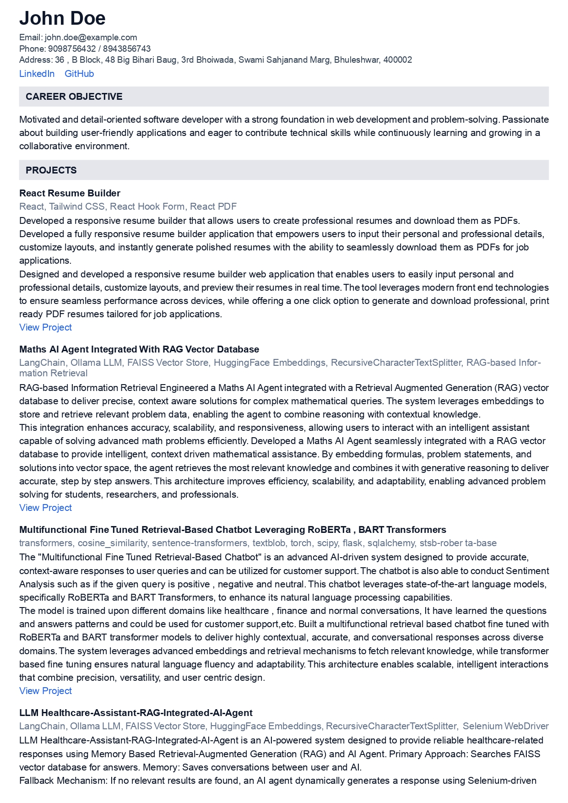

- [STANDARD-RESUME-PDF-LINK](https://github.com/sambhu431/react-resume-builder/blob/main/sample-resume-pdf/John-STANDARD-RESUME-Sample.pdf)
- 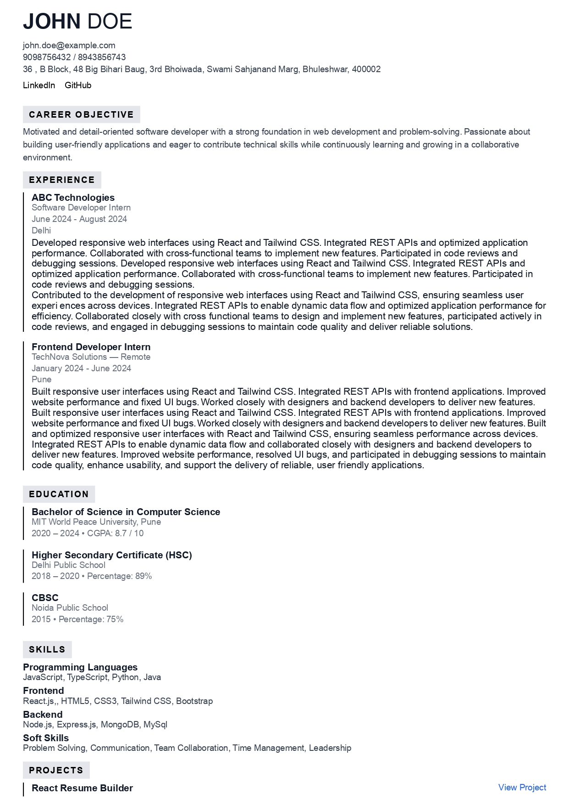

- [SIMPLE-ATS-RESUME-PDF-LINK](https://github.com/sambhu431/react-resume-builder/blob/main/sample-resume-pdf/John-SIMPLE-ATS-RESUME-Sample.pdf)
- 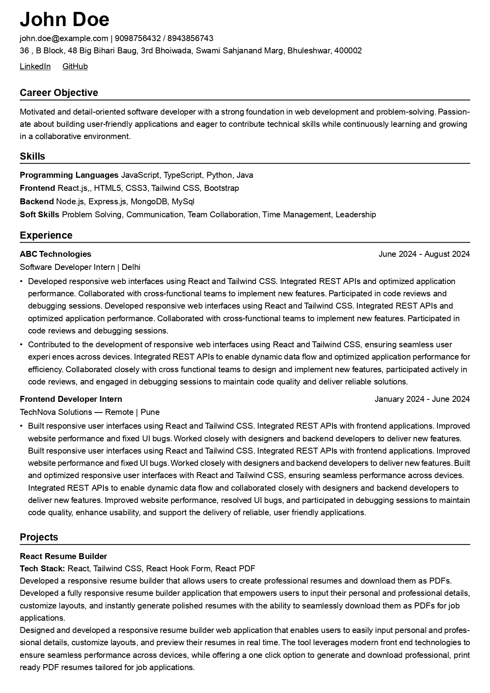

- [PROFESSIONAL-RESUME-PDF-LINK](https://github.com/sambhu431/react-resume-builder/blob/main/sample-resume-pdf/John-PROFESSIONAL-RESUME-Sample.pdf)
- 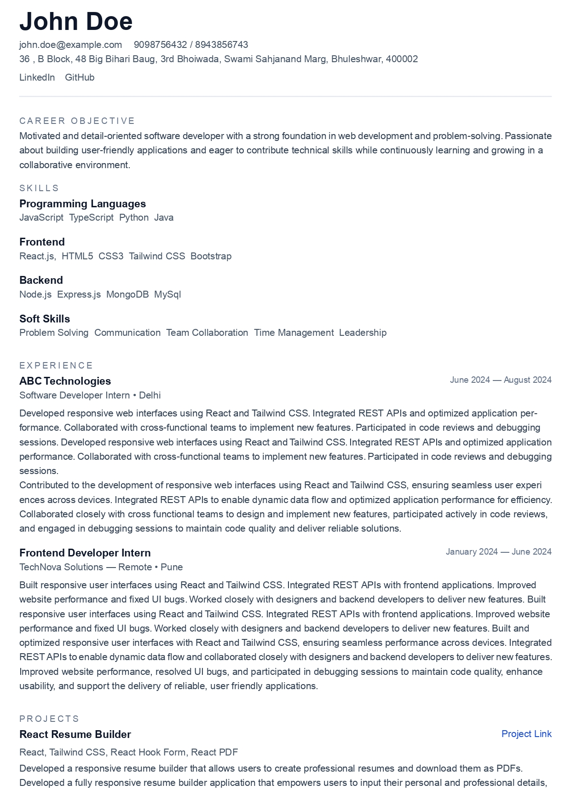

- [PRIME-ATS-RESUME-PDF-LINK](https://github.com/sambhu431/react-resume-builder/blob/main/sample-resume-pdf/John-PRIME-ATS-RESUME-Sample.pdf)
- 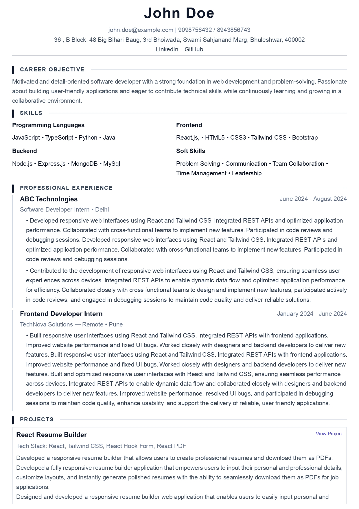


- [TRADITIONAL-RESUME-PDF-LINK](https://github.com/sambhu431/react-resume-builder/blob/main/sample-resume-pdf/John-TRADITIONAL-RESUME-Sample.pdf)
- 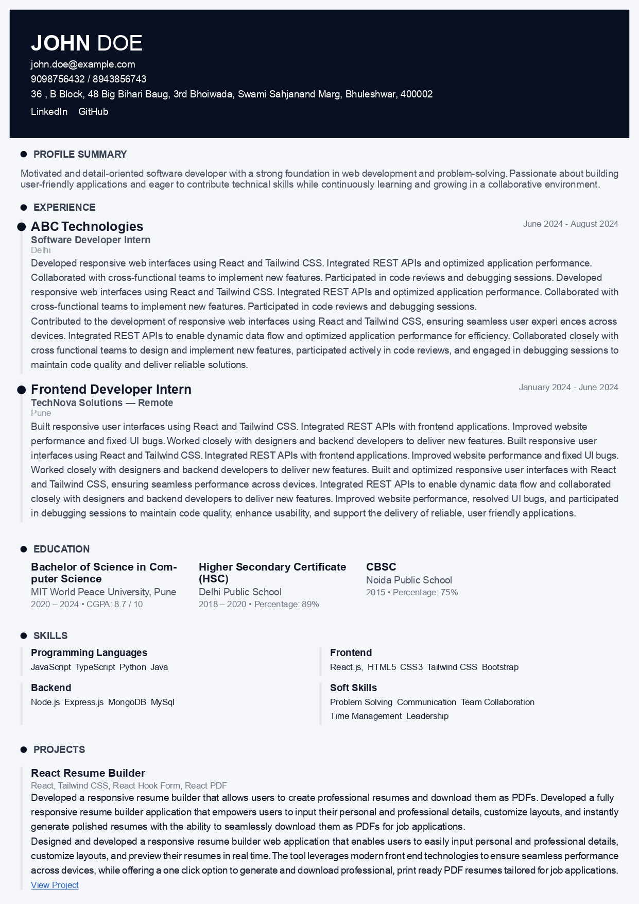

- [PRECISION-ATS-RESUME-PDF-LINK](https://github.com/sambhu431/react-resume-builder/blob/main/sample-resume-pdf/John-PRECISION-ATS-RESUME-Sample.pdf)
- 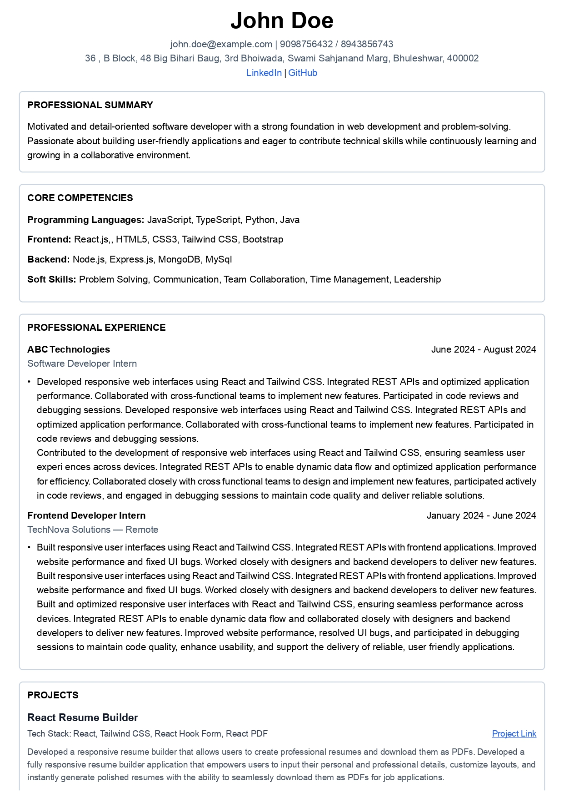

- [MINIMAL-RESUME-PDF-LINK](https://github.com/sambhu431/react-resume-builder/blob/main/sample-resume-pdf/John-MINIMAL-RESUME-Sample.pdf)
- 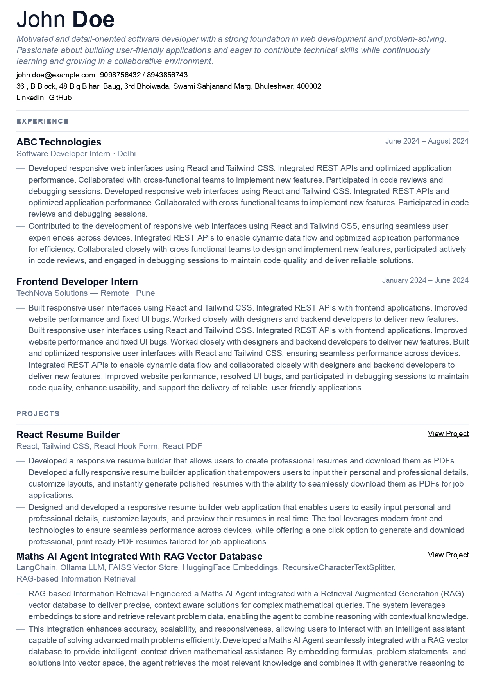

- [ENTRY-LEVEL-RESUME-PDF-LINK](https://github.com/sambhu431/react-resume-builder/blob/main/sample-resume-pdf/John-ENTRY-LEVEL-RESUME-Sample.pdf)
- 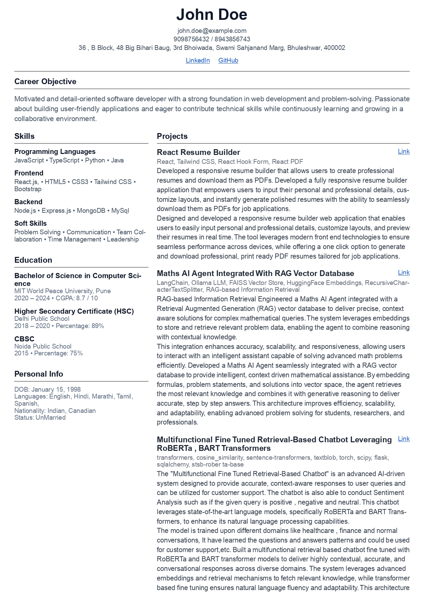

- [CLEAN-RESUME-PDF-LINK](https://github.com/sambhu431/react-resume-builder/blob/main/sample-resume-pdf/John-CLEAN-RESUME-Sample.pdf)
- 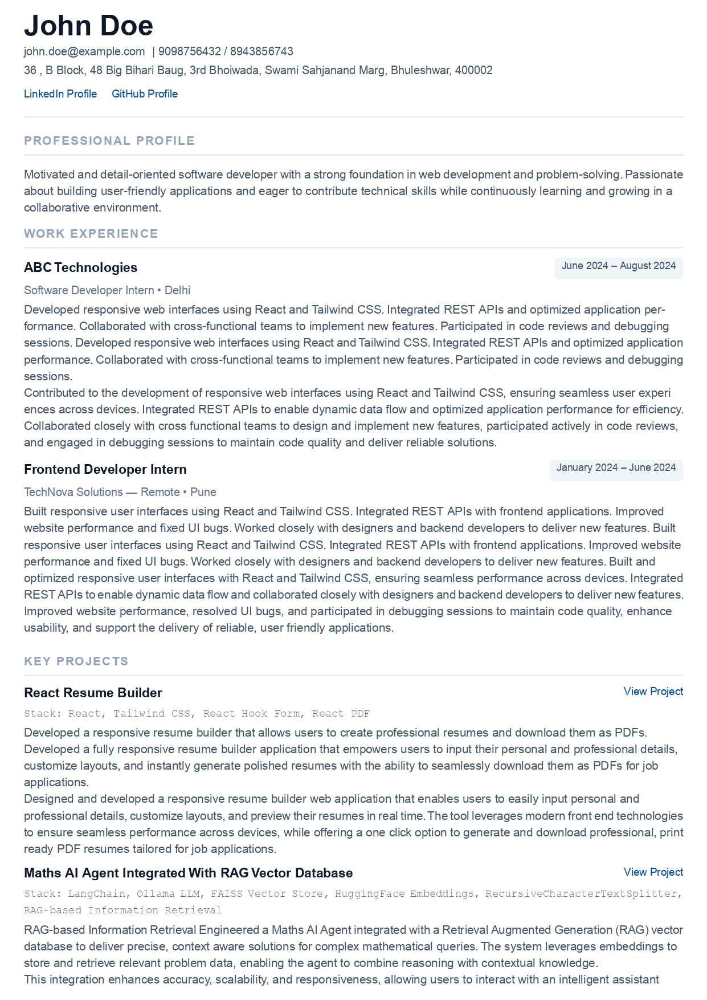

- [ACADEMIC-RESUME-PDF-LINK](https://github.com/sambhu431/react-resume-builder/blob/main/sample-resume-pdf/John-ACADEMIC-RESUME-Sample.pdf)
- 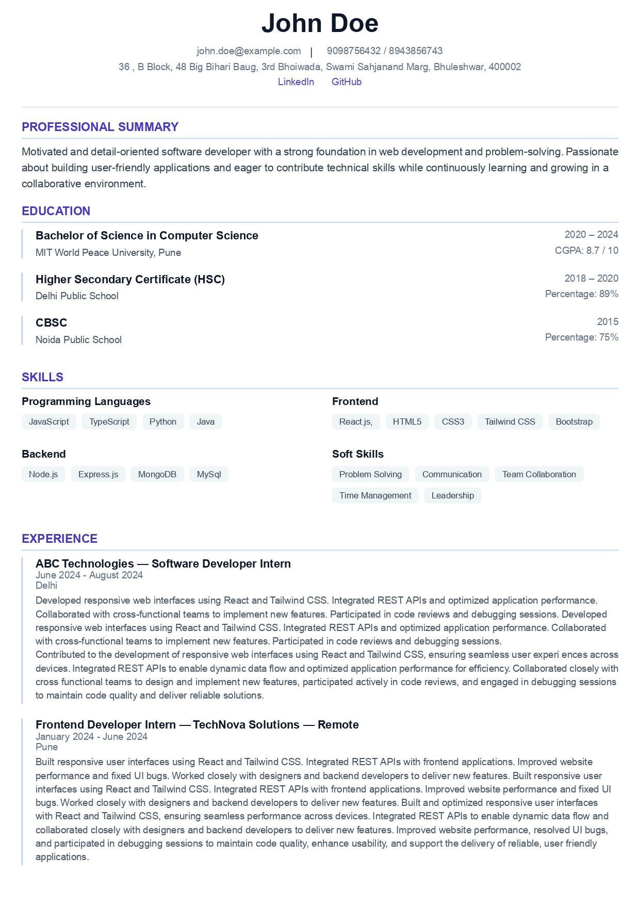

- [CLASSIC-RESUME-PDF-LINK](https://github.com/sambhu431/react-resume-builder/blob/main/sample-resume-pdf/John-CLASSIC-RESUME-Sample.pdf)
- 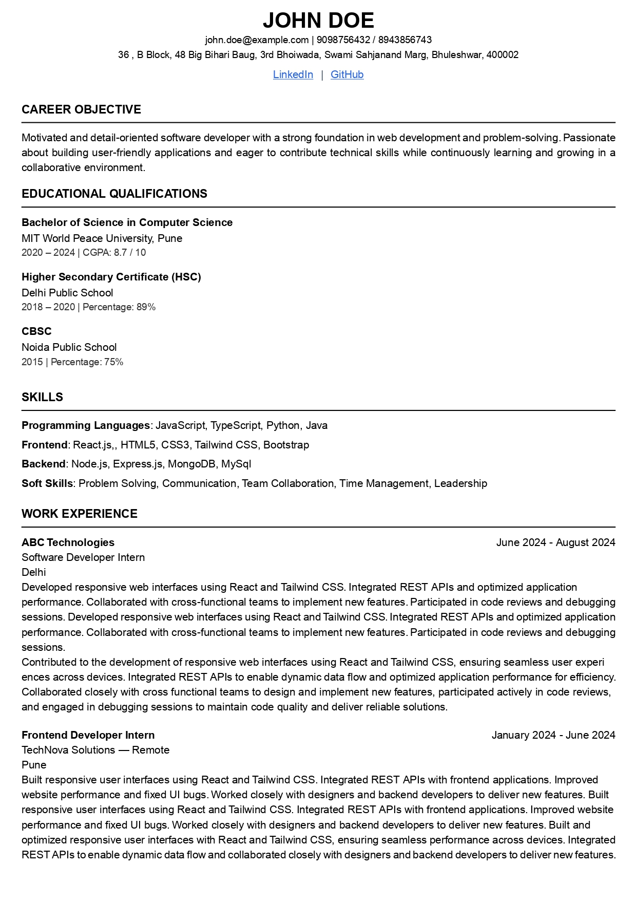

---

## Tech Stack

- React 19
- Vite
- Tailwind CSS
- Formik
- Yup (validation)
- React Router DOM
- React PDF Renderer
- React Zoom Pan Pinch

---

## Project Structure

```text
src/
├── components/
├── pages/
├── data/
├── localStorage/
├── index.css
├── App.jsx
└── main.jsx
```

---

## Installation & Setup

Clone the repository:

```bash
git clone https://github.com/sambhu431/react-resume-builder
```

Navigate to the project:

```bash
cd <repo-name>
```

Install dependencies:

```bash
npm install
```

Run development server:

```bash
npm run dev
```

Build for production:

```bash
npm run build
```

---

## Future Improvements

- Save resumes in database
- Multi-Theme resume templates
- Export as DOCX
- Cloud storage integration
- AI-powered resume suggestions

---

## License 
This project is licensed under the MIT License.

--- 

## About

This project was built to strengthen practical skills in React, Tailwind CSS, form handling, responsive UI design, and PDF generation. It focuses on providing a smooth resume-building experience with real-time preview and PDF export capabilities.

---

## Contributions

Please feel free to contribute to this project by submitting issues or pull requests.

Any enhancements, bug fixes, or optimizations are extremely welcomed!

